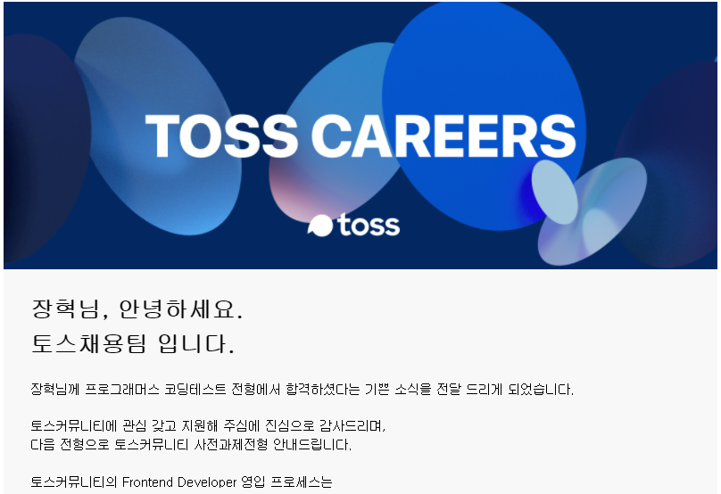

---

# 시작하기까지

난 프로그래머스를 잘 들여다 보지않아서 처음엔 이 챌린지가 있는지도 잘 몰랐다. 이직에 관심 있는 친구가 이번 거 해보는게
어떻겠냐고 제안을 해 와서 내 개발 역량을 체크할 겸 해보기로 하였다.

## 지원한 기업
나는 총 4곳에 지원했다.

- 토스
- 당근마켓
- 클래스 101
- 겟차

---

# 테스트 준비 과정
지금은 내 개발 역량 체크를 목적으로 풀기에 따로 많은 공부를 하지는 않았다.  
예전에 학교에서 비슷한 챌린지를 했었을 땐 캠도 안 켜고 그냥 개인 재량껏 잘 풀고 제출하면 됐었는데 편법을 쓰는 사람이 많은지
이번 챌린지에서는 휴대폰으로 캠을 키고, 화면공유까지 하면서 문제를 풀라고 했었다. 그래서 문제 풀기 30분 전쯤부터 잘 동작하는지 테스트를 했었다.

---

# 풀고난 후

`자세한 문제 내용은 유출되면 안 된다고 쓰여있어 따로 적지는 않았다.`  

주어진 시간은 3시간이었고, 기본적으로 요구하는 사항은 문제없이 돌아가도록 구현했지만 풀면서 많이 아쉬웠다.
시간 안에 구현하려고 짜려다 보니 효율적이고 좋은 코드를 짰다기보다는 기능을 실행하기 위해 중구난방으로 짠 느낌이 강했다.
아직은 좋은 코드를 짜는 습관이 몸에 베지 않았다는 걸 느끼게 되는 계기가 되었다. 기능 구현은 다 되었지만 유지 보수에 좋은 코드는
만들지 못해 아마 지원한 곳 대부분은 붙지 못할 거라 생각했다.

## 토스?

코테를 본 후 한 3일? 정도 후에 겟차, 당근 마켓 등에서 보고 1주 정도가 지나도 토스 쪽에서는 아직 확인을 안 해 기대를 접고 있었다.  
가장 늦게 확인한 곳이 토스였는데 확인 후 거의 20~30분 안으로 합격했다는 메일이 왔다. ㄷㄷ
토요일은 시간이 안되어 일요일로 사전과제를 풀겠다고 답장을 보냈다.

[토스 사전과제 후기](/)

# 마치며

`겟차 쪽은 아쉽게 떨어졌고, 나머지는 아직 답장이 없다. (마음의 준비중)`  

개발 역량 체크를 목적으로 시작했지만 좋은 경험이었다. (막상 하기 전까진 하기가 되게 귀찮았다..)